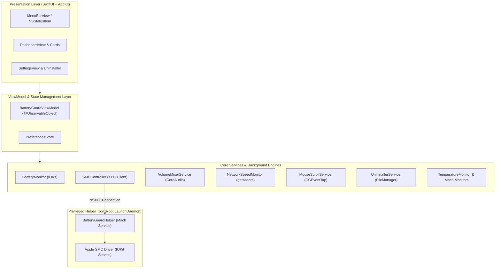

# BatteryGuard ⚡️🛡️

> **The ultimate macOS system companion & power management suite for Apple Silicon and Intel Macs.**  
> Effortlessly manage battery charge thresholds, control per-app volume levels, monitor real-time hardware telemetry, decouple mouse scroll directions, and cleanly uninstall applications with a modern, high-end Soft UI.

---

[](https://apple.com/macos)
[](https://swift.org)
[](https://apple.com)
[](https://github.com/yonaskolb/XcodeGen)
[](https://developer.apple.com/xcode/swiftui/)
[](#license)

---

## 🌟 Highlights

* **🔋 Smart Battery & Charge Control:** Hardware-level SMC threshold limiter (80% preservation limit, sailing mode, top-up mode) to extend battery lifespan.
* **🎚️ Per-App Volume Mixer:** Individual audio level adjustment, mute/solo controls, +200% volume boosting, and custom output device routing via CoreAudio Process Taps.
* **📊 Comprehensive Hardware Telemetry:** Real-time metrics for CPU, GPU, RAM, Network speeds (Up/Down), Thermal zones, and power consumption (Watts/Volts/Amperes).
* **🖱️ Mouse & Trackpad Scroll Decoupling:** Invert physical mouse wheel scrolling without affecting macOS natural trackpad gestures.
* **🧹 Deep Application Uninstaller:** Drag-and-drop application analyzer that identifies and purges orphaned caches, preferences, logs, and application support files.
* **✨ Modern Soft UI & Menu Bar:** Native AppKit status bar items with customizable live metrics and an expansive, beautifully structured dashboard.

---

## 📸 Overview & Key Modules

```
┌────────────────────────────────────────────────────────────────────────────┐
│                                BATTERYGUARD                                │
├───────────────────┬───────────────────┬───────────────────┬────────────────┤
│ 🔋 Battery & SMC  │ 🎚️ Volume Mixer    │ 📊 Telemetry Hub  │ 🧹 Uninstaller │
│ • Charge Limiter  │ • CoreAudio Taps  │ • CPU / GPU / RAM │ • Deep Junk    │
│ • Health & Cycles │ • Boost Limiter   │ • Network Speed   │   Analyzer     │
│ • Power Flow (W)  │ • Device Routing  │ • Thermal Zones   │ • Trash Purge  │
└───────────────────┴───────────────────┴───────────────────┴────────────────┘
```

### 1. 🔋 Battery Health & SMC Charge Management
- **Hardware-Level Limiters:** Communicates directly with the Apple System Management Controller (SMC) via a privileged helper tool (`BatteryGuardHelper`) using `CHTE`, `BCLM`, and related registers.
- **Sailing & Top-Up Mode:** Stop charging at 80% (or custom percentage), bypass power directly to AC, and easily trigger a 100% top-up when preparing for travel.
- **Detailed Power Telemetry:**
  - Real-time State of Charge (SoC), Amperage, Voltage, and Instantaneous Wattage.
  - Design Capacity vs. Maximum Capacity calculation.
  - Cycle count analysis and health degradation estimation.
  - Power adapter specifications (Wattage, Voltage, Amperage, Manufacturer).
  - Historical cycle and battery level tracking.

### 2. 🎚️ Per-App Volume Mixer & Audio Routing
- **Process Audio Tapping:** Employs CoreAudio `AudioHardwareCreateProcessTap` and Aggregate Devices for zero-latency audio interception.
- **Per-App Level Controls:** Granular volume faders, mute/solo toggles, and live RMS/peak VU meters for active audio-producing processes.
- **Volume Boost Limiter:** Amplify quiet audio up to +200% with soft-knee limiter and clipping protection using Apple's Accelerate framework (`vDSP`).
- **Independent Audio Routing:** Route specific apps to headphones, external monitors, or DACs independently from the system default output.

### 3. 📊 Real-Time System & Hardware Telemetry
- **CPU Monitoring:** Mach kernel host statistics (`host_processor_info`) measuring User, System, and Idle percentages across Performance and Efficiency cores.
- **GPU & VRAM:** IOKit accelerator statistics tracking GPU utilization and memory footprint.
- **Memory Pressure:** Active, Wired, Compressed, Free, and Cached RAM metrics with system pressure alerts.
- **Network Speed Monitor:** High-frequency `getifaddrs` sampling displaying live Download and Upload transfer rates (KB/s or MB/s) in the menu bar.
- **Thermal Sensors:** Multi-zone temperature readouts across CPU cores, GPU clusters, and battery cells.
- **Top Energy Consumers:** Identifies high-drain background processes.

### 4. 🖱️ Mouse & Trackpad Scroll Direction Utility
- **Accessibility Event Tap (`CGEventTap`):** Intercepts low-level scroll wheel events to reverse physical mouse scroll direction.
- **Natural Trackpad Preservation:** Keeps macOS natural scrolling intact for trackpads while enabling standard scrolling on external mice.

### 5. 🧹 Complete Application Uninstaller
- **Deep System Scanning:** Analyzes application bundles and locates associated leftovers in:
  - `~/Library/Application Support/`
  - `~/Library/Caches/` & `~/Library/Caches/WebKit/`
  - `~/Library/Preferences/` & `~/Library/Preferences/ByHost/`
  - `~/Library/Saved Application State/`
  - `~/Library/Logs/` & `~/Library/HTTPStorages/`
  - `~/Library/Containers/` & `~/Library/Group Containers/`
  - `~/Library/LaunchAgents/`
- **Safe Removal:** Calculates total disk space reclaimable and moves files safely to Trash.

---

## 🏗️ Architecture & Technology Stack

BatteryGuard is engineered using a modular, decoupled architecture adhering to **SOLID**, **DRY**, and **KISS** principles.



* **Frontend:** SwiftUI 5 & AppKit (`NSStatusItem`, `NSPopover`, `NSWindowController`).
* **Audio Engine:** CoreAudio Process Taps, AudioToolbox, Accelerate (`vDSP`).
* **Hardware & Telemetry:** IOKit (`IOPMPowerSource`, `AppleSmartBattery`), Mach Kernel APIs (`mach/mach.h`), `sysctl`.
* **Privileged IPC:** Apple ServiceManagement (`SMJobBless` / LaunchDaemons), `NSXPCConnection` conforming to `BatteryGuardXPCProtocol`.
* **Build System:** [XcodeGen](https://github.com/yonaskolb/XcodeGen) for declarative, deterministic project configuration.

---

## 📁 Repository Structure

```
BatteryGuard/
├── BatteryGuard/                      # Main macOS Application
│   ├── App/                           # Entry point & AppKit AppDelegate
│   ├── MenuBar/                       # Menu bar status item & popup view
│   ├── Dashboard/                     # Main dashboard window & modular cards
│   │   ├── Cards/                     # Battery, Mixer, Telemetry, Network cards
│   │   └── Sidebar/                   # Navigation sidebar
│   ├── Services/                      # Battery, Audio, Network, Scroll services
│   ├── ViewModels/                    # Observable state management
│   ├── Models/                        # Data models & telemetry structures
│   ├── Settings/                      # Preferences & configurations
│   ├── Uninstaller/                   # App uninstaller engine & UI
│   ├── Resources/                     # Info.plist, Entitlements, Assets
│   └── XPC/                           # XPC client connection manager
├── BatteryGuardHelper/                # Privileged Root Helper Tool
│   ├── main.swift                     # Mach service listener
│   ├── HelperTool.swift               # XPC protocol implementation
│   ├── SMCController.swift            # Low-level SMC read/write routines
│   └── Info.plist & Entitlements      # LaunchDaemon configurations
├── Shared/                            # Shared XPC protocols & constants
│   └── BatteryGuardXPCProtocol.swift
├── Scripts/                           # Automation & diagnostic utilities
│   ├── install_helper.sh              # Privileged helper daemon installer
│   └── smc_attr_scan.swift            # Standalone SMC register scanner
├── References/                        # Reference documentation & benchmarks
├── project.yml                        # XcodeGen project specification
└── README.md                          # Project documentation
```

---

## 🚀 Getting Started

### Prerequisites
* **macOS:** macOS 13.0 (Ventura) or newer.
* **Architecture:** Apple Silicon (M1/M2/M3/M4) or Intel Mac.
* **Xcode:** Xcode 15.0+ with Swift 5.9+.
* **XcodeGen:** Required to generate `.xcodeproj` (`brew install xcodegen`).

---

### Building & Running from Source

1. **Clone the Repository:**
   ```bash
   git clone https://github.com/adityaibrar/BatteryGuard.git
   cd BatteryGuard
   ```

2. **Generate the Xcode Project:**
   ```bash
   xcodegen generate
   ```

3. **Open in Xcode:**
   ```bash
   open BatteryGuard.xcodeproj
   ```

4. **Build & Run:**
   - Select the `BatteryGuard` scheme.
   - Press `Cmd + R` to build and launch the application.

---

### Installing the Privileged Helper Daemon

For hardware charge limiting (SMC register control), the privileged helper daemon must be registered with `launchd`:

1. Build the project in Xcode and copy `BatteryGuard.app` to your `/Applications` directory.
2. Run the helper installation script with root privileges:
   ```bash
   sudo bash Scripts/install_helper.sh
   ```
3. The helper will be installed to `/Library/PrivilegedHelperTools/com.ibrardev.BatteryGuard.Helper` and loaded as a persistent `LaunchDaemon`.

---

## 🔒 Permissions & Security

BatteryGuard is built with security and transparency in mind:

| Permission | Purpose | Required For |
| :--- | :--- | :--- |
| **Privileged Helper (`launchd`)** | SMC register manipulation (e.g. `CHTE`, `BCLM`) | Battery charge limiter & hardware control |
| **Accessibility (`AXIsProcessTrusted`)** | Low-level event tap (`CGEventTap`) | Independent mouse wheel scroll inversion |
| **Audio Capture / Process Tap** | Real-time CoreAudio process stream tapping | Per-app volume adjustment & routing |

*Note: BatteryGuard runs locally on your Mac. No telemetry or audio data is ever transmitted over the network.*

---

## 🛠️ Utility Scripts

The `Scripts/` directory contains standalone utilities for testing and setup:

* **[install_helper.sh](file:///Users/IbrarDev/Development/Projects/macos/BatteryGuard/Scripts/install_helper.sh):** Installs and starts the `BatteryGuardHelper` LaunchDaemon.
* **[smc_attr_scan.swift](file:///Users/IbrarDev/Development/Projects/macos/BatteryGuard/Scripts/smc_attr_scan.swift):** Interactive command-line script to inspect SMC keys and verify writable attributes on Apple Silicon.
  ```bash
  sudo swift Scripts/smc_attr_scan.swift
  ```

---

## 🤝 Contributing

Contributions, feature ideas, and pull requests are welcome!

1. Fork the Project.
2. Create your Feature Branch (`git checkout -b feat/AmazingFeature`).
3. Commit your Changes (`git commit -m 'feat: add some AmazingFeature'`).
4. Push to the Branch (`git push origin feat/AmazingFeature`).
5. Open a Pull Request.

---

## 📄 License

This project is licensed under the **MIT License** (or as designated by the author). Portions of the audio mixer reference implementation are licensed under GNU GPL v3.0+. See [LICENSE](LICENSE) for details.

---

<p align="center">
  Crafted with ❤️ for macOS power users by <a href="https://github.com/adityaibrar">Aditya Ibrar</a>.
</p>
